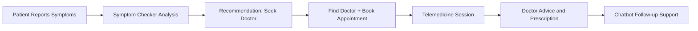

# CareLink Platform - System Workflows

## Overview
This document describes the end-to-end system workflows for the three core modules:

1. Chatbot
2. Symptom Checker
3. Telemedicine

The flows are based on the current implementation patterns and endpoint structures in the repository.

---

## 1. Chatbot Workflow

### Workflow Summary
The chatbot module supports conversation lifecycle management and message exchanges between a patient and an AI assistant.

### Key Functional Steps
1. User creates or opens a conversation.
2. User sends a message.
3. Service stores the user message in MongoDB.
4. Service loads conversation history.
5. AI reply is generated using diagnosis context + history.
6. Assistant reply is saved and returned.
7. User can list, update, or delete messages/conversations.

### Typical API Surface (Current Implementation Pattern)
- Conversation create/list/get/update/delete under `/api/chatbot/conversations`.
- Message create/list under conversation routes.
- Message update/delete under `/api/chatbot/messages/{message_id}`.

### Diagram
```mermaid
flowchart LR
    A[Patient Opens Chat UI] --> B[Create or Select Conversation]
    B --> C[POST /api/chatbot/conversations/{id}/messages]
    C --> D[Validate Payload]
    D --> E[Store User Message in MongoDB]
    E --> F[Load Conversation History]
    F --> G[Generate AI Reply via Chat Service]
    G --> H[Store Assistant Message]
    H --> I[Return User + Assistant Messages]
    I --> J[Render Updated Chat in Frontend]
    J --> K{User Action}
    K -->|Continue| C
    K -->|Edit Message| L[PUT /api/chatbot/messages/{message_id}]
    K -->|Delete Message| M[DELETE /api/chatbot/messages/{message_id}]
    K -->|Manage Conversation| N[GET/PUT/DELETE /api/chatbot/conversations/{id}]
```

---

## 2. Symptom Checker Workflow

### Workflow Summary
The Symptom Checker accepts symptom inputs, runs a prediction pipeline, enriches with recommendation metadata, and stores analysis history for later retrieval and feedback.

### Key Functional Steps
1. Patient submits symptoms and optional context.
2. Service performs prediction using trained model components.
3. Service calculates confidence and triage level.
4. Result is saved as an analysis record.
5. Frontend displays prediction, advice, and precautions.
6. Patient can provide feedback or review history.

### Typical API Surface (Current Implementation Pattern)
- Analysis create: `/api/symptom-checker/analyze`
- Analysis get/update/delete: `/api/symptom-checker/analyze/{analysis_id}`
- Feedback: `/api/symptom-checker/analyze/{analysis_id}/feedback`
- History: `/api/symptom-checker/history/{user_id}`
- Stats and symptom metadata endpoints available.

### Diagram
```mermaid
flowchart LR
    A[Patient Enters Symptoms] --> B[POST /api/symptom-checker/analyze]
    B --> C[Input Validation]
    C --> D[Feature Extraction]
    D --> E[Model Prediction]
    E --> F[Confidence + Triage Scoring]
    F --> G[Generate Recommendation and Warnings]
    G --> H[Persist Analysis in Database]
    H --> I[Return Assessment to Frontend]
    I --> J[Display Condition, Confidence, Next Steps]
    J --> K{Follow-up Actions}
    K -->|View History| L[GET /api/symptom-checker/history/{user_id}]
    K -->|Update Analysis| M[PUT /api/symptom-checker/analyze/{analysis_id}]
    K -->|Submit Feedback| N[PATCH /api/symptom-checker/analyze/{analysis_id}/feedback]
    K -->|Delete Record| O[DELETE /api/symptom-checker/analyze/{analysis_id}]
```

---

## 3. Telemedicine Workflow

### Workflow Summary
Telemedicine connects appointment context, secure video token generation, and live consultation session operations (start/end/messages/notes).

### Key Functional Steps
1. Patient books appointment and reaches consultation window.
2. Frontend requests video token for appointment.
3. Session is started by authorized participant.
4. Doctor and patient join call through video provider integration.
5. In-session chat messages and doctor notes can be recorded.
6. Session is ended and status is updated.

### Typical API Surface (Current Implementation Pattern)
- Token generation: `/api/v1/telemedicine/video/token/{appointmentId}`
- Session get/start/end/messages/notes under `/api/v1/telemedicine/session/{appointmentId}`

### Diagram
```mermaid
flowchart LR
    A[Appointment Confirmed] --> B[Open Telemedicine UI]
    B --> C[GET /api/v1/telemedicine/video/token/{appointmentId}]
    C --> D[Generate Agora Token]
    D --> E[Return Token + Channel Data]
    E --> F[Client Joins Video Session]
    F --> G[POST /api/v1/telemedicine/session/{appointmentId}/start]
    G --> H[Session Status = In Progress]
    H --> I{During Consultation}
    I -->|Chat Message| J[POST /api/v1/telemedicine/session/{appointmentId}/messages]
    I -->|Doctor Note| K[POST /api/v1/telemedicine/session/{appointmentId}/notes]
    I -->|Fetch Session| L[GET /api/v1/telemedicine/session/{appointmentId}]
    J --> I
    K --> I
    L --> I
    I --> M[POST /api/v1/telemedicine/session/{appointmentId}/end]
    M --> N[Session Closed + Metadata Stored]
```

---

## Cross-Service Workflow Integration

### High-Level Interaction
1. Symptom Checker helps identify probable condition and urgency.
2. Patient can proceed to doctor discovery and booking.
3. Telemedicine supports the remote consultation.
4. Chatbot can assist before and after consultation for guidance and follow-up interactions.



---

## Notes
- The exact endpoint set can evolve. This document captures the currently observed implementation direction and module responsibilities.
- For strict API-contract documentation, maintain an OpenAPI specification per service.
